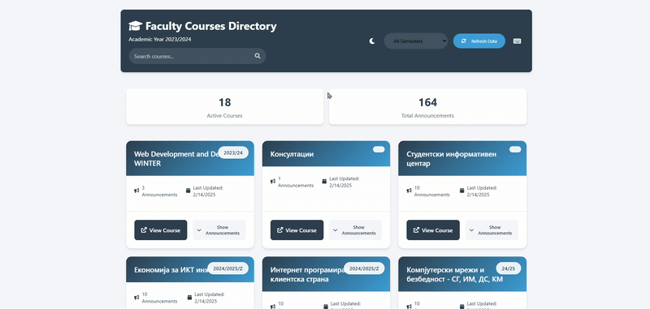

# 🎓 Faculty Courses Directory

A sophisticated web scraping solution for aggregating and displaying course information from the Faculty of Computer Science (FINKI) portal. Built with modern web technologies to demonstrate automated data collection and dynamic content rendering.

## 🎬 Demo


## ✨ Features

- **Modern UI/UX Design**  
  🎨 Clean interface with dark mode support and smooth animations
- **Real-time Search & Filter**  
  🔍 Instantly find courses with text search and semester filtering
- **Interactive Course Cards**  
  📱 Expandable course cards with announcements preview
- **Keyboard Shortcuts**  
  ⌨️ Quick actions with keyboard shortcuts (Press '?' to view all)
- **Responsive Design**  
  📱 Mobile-first approach, works on all devices
- **Smart Notifications**  
  🔔 Toast notifications for user feedback
- **Data Caching**  
  💾 Efficient data handling with local storage
- **Dark Mode**  
  🌙 Eye-friendly dark theme with system preference detection

## 🛠️ Tech Stack

- **Frontend**: Vanilla JavaScript, CSS3, HTML5
- **Backend**: Node.js, Express
- **Data Collection**: Puppeteer
- **Storage**: JSON, Local Storage

## ⚡️ Quick Start

1. **Clone & Install**
```bash
git clone https://github.com/mahmutmft/finki-scraper-app.git
cd finki-scraper-app
npm install
```

2. **Configure**
```bash
# Create .env in scraper directory
FINKI_USER="your_username"
FINKI_PASS="your_password"
```

3. **Run**
```bash
npm start
# Visit http://localhost:3000
```

## 🎯 Usage

- **Search**: Type to instantly filter courses
- **Filter**: Use dropdown to filter by semester
- **Dark Mode**: Click moon/sun icon or press Ctrl+D
- **Keyboard Shortcuts**: Press '?' to view all shortcuts
- **Update Data**: Click refresh button or press Ctrl+R
- **View Course**: Click course card to expand details

---

<div align="center">
    <p>
        <a href="https://github.com/mahmutmft">
            
        </a>
        <a href="https://github.com/mahmutmft/finki-scraper-app/blob/main/LICENSE">
            
        </a>
        
    </p>
    <p>© 2024 Mahmut. All rights reserved.</p>
</div>


